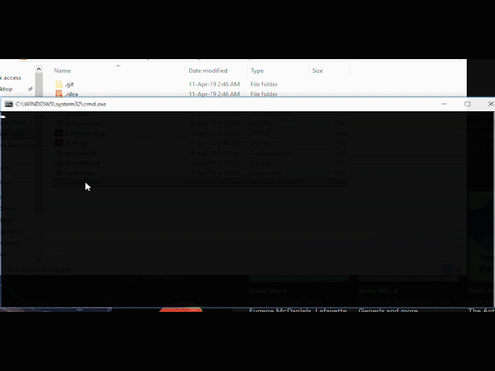

# Combinatrix

### Combinar horarios para ITBA """dinámicamente""" 

## Motivación
Sos un alumno de tercer año. El día antes de anotarse para las materias que queres te das cuenta:
no solo tenes que combinar horarios de materias, tenes que combinar... las materias mismas!

Enter: Combinatrix. La plataforma del futuro. Lo que Combinar Horarios (Matias Dwek (C)) nunca fue.
La salvación. La esperanza. El rayo de luz en las tinieblas. Se entiende?

## Objetivo
Un interfaz gráfico donde el usuario pueda elegir criterios para la combinación de materias. Estos incluyen, pero no están limitados a días libres, superposiciones permitidas. Que devuelva cada cursada posible en la misma interfaz grafica. El usuario va poder navegarlas, eliminar los horarios inconvenientes y guardar a archivo los horarios preferidos. 

## Donde estamos
~Por ahora no está habilitada la combinación por día libre/superposición. Esto es para testear el programa y ver que funcione bien antes de incluir todas los features~ Funciona con superposiciones! Pueden encontrar un ejecutable en [whittileaks.com](http://www.whittileaks.com) bajo la pestaña **Combinatrix**.

## FAQ
### Que hace un código de python ahí?
Ese fue el primer código que escribí... Febrero de 2017. Retome el proyecto con Go en Marzo 2019.
